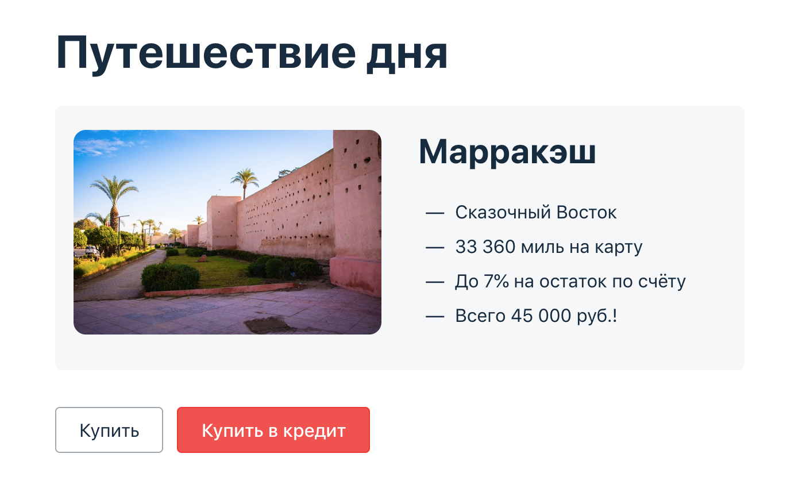

# Дипломный проект по профессии «Тестировщик»
Целью дипломного проекта является автоматизация тестирования комплексного сервиса, взаимодействующего с СУБД и API Банка.

## Описание приложения
Приложение — это веб-сервис, который предлагает купить тур по определённой цене двумя способами:
- Обычная оплата по дебетовой карте.
- Уникальная технология: выдача кредита по данным банковской карты.

Приложение пересылает данные по картам банковским сервисам:
- сервису платежей, далее Payment Gate;
- кредитному сервису, далее Credit Gate.

Также заявлена поддержка двух СУБД:
- MySQL;
- PostgreSQL.

## Процедура запуска автотестов

### Требуемые приложения для запуска:

- GIT
- IntelliJ IDEA
- Docker
- Google Chrome

### Подготовительный этап:

1. Установить на локальный компьютер и запустить Docker;
2. Склонировать репозиторий на локальный компьютер командой в Git: **git clone https://github.com/Mariyam197/qa-diploma.git** 
или скачать архив по [ссылке](https://github.com/Mariyam197/qa-diploma);
3. Запустить IntelliJ IDEA и открыть проект.

### Запуск приложения:
1. В терминале запустить необходимые базы данных (MySQL, PostgreSQL), а также NodeJS командой: **docker-compose up**.
2. В новой вкладке терминала запустить приложение в завистимости от базы данных командой:
- MySQL: **java -jar ./artifacts/aqa-shop.jar -P:jdbc.url=jdbc:mysql://localhost:3306/app**
- PostgreSQL: **java -jar ./artifacts/aqa-shop.jar -P:jdbc:postgresql://localhost:5432/app**

### Запуск тестов
В новой вкладке терминала ввести команду: **./gradlew clean test --info**

### Примечание
Для запуска тестов на СУБД Postgresql необходмо в файле **application.properties** строку 
**#spring.datasource.url=jdbc:postgresql://localhost:5432/app**
раскомитить, а строку **spring.datasource.url=jdbc:mysql://localhost:3306/app**
закомитить. Чтобы тесты смогли получить доступ к необходимой базе данных, в файле SQL, необходимо изменить url 
на **jdbc:postgresql://localhost:5432/app**.

### Формирование отчёта по результатам тестирования
В вкладке терминала ввести команду: **./gradlew allureServe**

Отчёт откроется автоматически в браузере по умолчанию. После просмотра и закрытия отчёта необходимо остановить работу команды, нажав Ctrl+С.

### Перезапуск приложения и тестов:
Во вкладке терминала, где запущено приложение, ввести команду Ctrl+С. 
Для прекращения работы контейнеров во вкладке терминала, где запущены базы данных, ввести команду Ctrl+С, далее ввести 
docker-compose down

