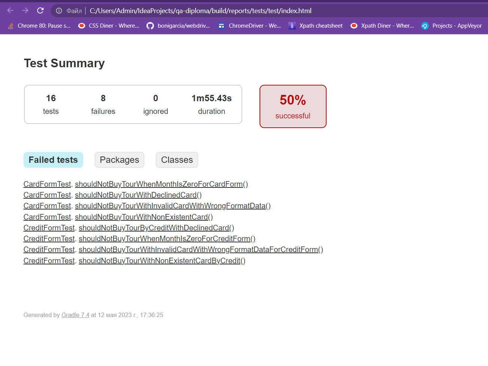
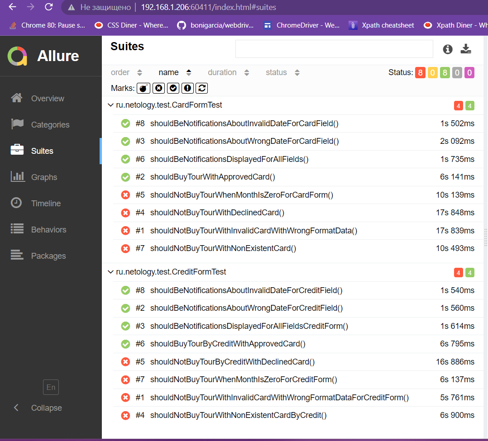

# Отчётные документы по итогам тестирования

## Краткое описание

Выполнена автоматизация тестирования комплексного сервиса, взаимодействующего с СУБД и API Банка.

## Количество тест-кейсов
Всего было выполнено 16 автоматизированных тестов, из них:

- 8 тестов прошли успешно, что составляет 50%;
- 8 тестов провалились, что составляет 50%.

## Отчет Gradle

## Отчет Allure

## Общие рекомендации

1. Добавить уникальные идентификаторы (test-id) элементам страницы для упрощения автоматизации тестов;
2. Исправить все критические дефекты;
3. Кнопку "Продолжить" сделать активной только после того, как все поля будут корректно заполнены;
4. Составить более подробную и понятную документацию к приложению. 
